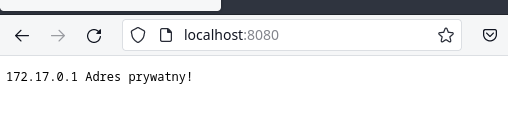
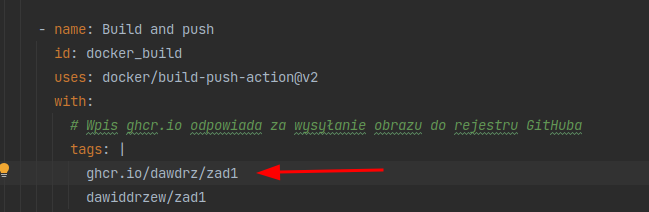
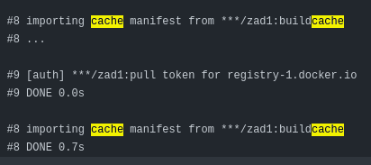

Zadanie 1

3. 

Polecenie do zbudowania obrazu kontenera:
`docker build -t dawiddrzew/zad1 .`

Polecenie do uruchomienia kontenera:
`docker run -d --name zad1 -p 8080:8080 dawiddrzew/zad1`

Polecenie do uzyskania informacji, które wygenerował serwer przy starcie:
`docker logs zad1`

Polecenie do sprawdzenia ile warstw posiada obraz:
`docker history dawiddrzew/zad1`

Zrzut ekranu okna przeglądarki:

4. 

Przed zbudowaniem obrazów należy wykonać polecenia:

`docker run --rm --privileged multiarch/qemu-user-static --reset -p yes`

`docker buildx create --name builder --driver builder --bootstrap --use`

Za pomocą buildx można zbudować obrazy na wskazane architektury:

`docker buildx build -t dawiddrzew/zad1 --platform linux/arm64/v8,linux/amd64 . --push`

Dodatek 1.

Konfiguracja GitHub Container Registry:

Działanie cache:

Dodatek 2.

1. 
Uruchamianie rejestru:
`docker run -d -e REGISTRY_HTTP_ADDR=0.0.0.0:6677 -p 6677:6677 --name reg registry:2`

Pobieranie obrazu:
`docker pull ubuntu:latest`

Tagowanie obrazu dla utworzonego rejestru:
`docker image tag ubuntu:latest localhost:6677/ubuntu:latest`

Wysyłanie obrazu do utworzonego rejestru:
`docker push localhost:6677/ubuntu:latest`

2. 

Najpierw tworzymy katalog przechowujący dane do autoryzacji:
`mkdir auth`

Tworzymy plik do autoryzacji:
`docker run --entrypoint htpasswd httpd:2 -Bbn user pass > auth/htpasswd`

Uruchamiamy rejestr na nowo, z opcjami do autoryzacji:
`
docker run -d -p 6677:6677 -v "$(pwd)"/auth:/auth --restart=always --name reg -e REGISTRY_HTTP_ADDR=0.0.0.0:6677 -e "REGISTRY_AUTH=htpasswd" -e "REGISTRY_AUTH_HTPASSWD_REALM=Registry Realm" -e REGISTRY_AUTH_HTPASSWD_PATH=/auth/htpasswd registry:2
`